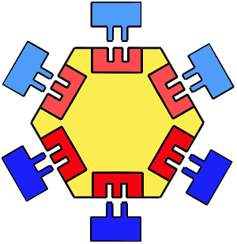

# 3. Arquitetura Hexagonal

Data: 2022-02-19

## Contexto

Espera-se que este microsserviço venha a ter um ciclo de vida de alguns anos.  
E que diferentes pessoas possam ter a oportunidade de contribuir com essa base de código.  
Espera-se também que os desafios deste microsserviço sejam semelhantes a outros sistemas de arquitetura semelhante: em especial, especializar-se em resolver um escopo limitado de problemas e ter a capacidade de conectar-se a outros sistemas.

## Decisão

Decidiu-se pelo emprego de uma arquitetura hexagonal, também conhecida como padrão de projeto Ports and Adapters.

Espera-se que esta arquitetura possa harmonizar muito bem com a natureza e desafios comuns a microsserviços.

https://alistair.cockburn.us/hexagonal-architecture/  
https://pt.slideshare.net/Nubank/arquitetura-funcional-em-microservices  
https://medium.com/noronha-dot-tech/my-take-on-hexagonal-architecture-with-elixir-a884aa1fbd19

## Consequências

A estrutura da arquitetura hexagonal pode facilitar:
- manutenibilidade do sistema por meio de um entendimento comum de conceitos como funções puras, encapsulamento e anticorrupção.
- eficiência e efetividade no emprego de testes de unidade.